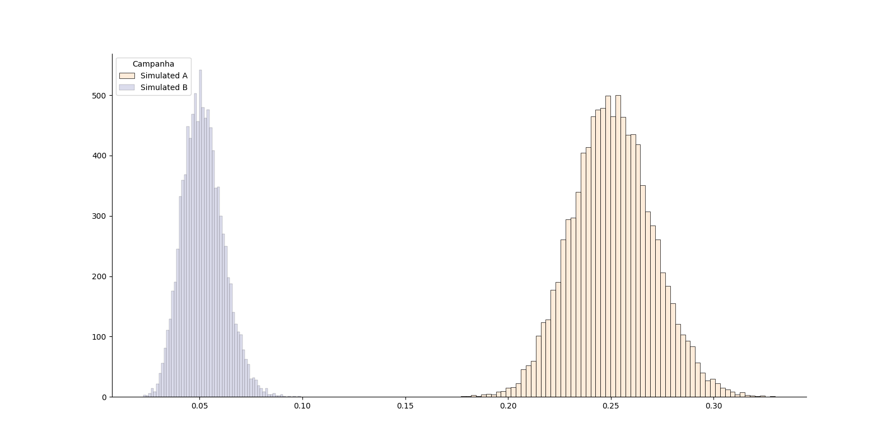

background-image: url(img/bayes_style.jpg)
background-size: contain
class: center, top

---
# Agenda

+ Aprendizado de Máquina

+ Estatística Frequentista

+ **Estatística Bayesiana**

    + Teste A/B 

    + Regressão

    + Prophet 

---
# Conceitos Fundamentais

.pull-left[


]

.pull-right[
+ **População**: Conjunto de todos os elementos sob investigação.

+ **Amostra**: Subconjunto da população.

+ **Variável de interesse**: característica a ser observada em cada indivíduo da amostra.

]


---
class: middle, center
background-color: #E0F2F1
# Aprendizagem de Máquina 

---
class: top, left
background-image: url(https://miro.medium.com/max/724/1*r73p1rxMZWnZLoYi5Odf4A.png)
background-size: contain

---
background-image: url(https://pbs.twimg.com/media/Dv7-J-tXQAAfQsN.jpg:large)
background-size: contain
<!-- Overfitting -->

---
# Característica Aprendizagem de Máquina

+ Prioriza Predição

+ No espírito fail fast, move quickly.

+ Não possui muitas suposições, mas possui. (i.i.d)

+ Otimização numérica dos desvios

---
# Vantagens / Desvantagens

.pull-left[

+ A prova do modelo é o desempenho do conjunto de teste.

+ Formas simples e genéricas de teste de performance emprestadas da estatística: reamostragem.

+ Métricas de desempenho de fácil compreensão.

+ Pode-se combiná-los de várias formas: ensembles.

]

.pull-right[

+ Interpretabilidade
+ Durabilidade

]

---
class: middle, center
background-color: #E0F2F1
# Estatística Frequentista

---
class: top, left
background-image: url(https://raw.githubusercontent.com/walmes/Tikz/master/src/variavel_aleatoria2.png)
background-size: contain

---
class: top, left
background-image: url(https://miro.medium.com/max/770/1*szMCjXuMDfKu6L9T9c34wg.png)
background-size: contain

---
class: top, left
background-image: url(https://raw.githubusercontent.com/walmes/Tikz/master/src/conceito_regressao.png)
background-size: auto

# Modelagem 

---

# Característica 

+ Prioriza Inferência

+ Distribuição de Probabilidade são assumidas para definição dos modelos

+ Possui pressupostos (i.i.d)


---
# Vantagens / Desvantagens

.pull-left[

+ Método Robusto

+ Metrifica a incerteza

+ Interpretabilidade

+ Pode ser analisado com poucos dados

]

.pull-right[

+ Tempo de Ajuste

+ Não é ideal para grandes dados 

]

---
class: middle, center
background-color: #E0F2F1
# Estatística Bayesiano

---
class: top, left
background-image: url(https://3.bp.blogspot.com/-TS6IWlltRZQ/TchlV7UB5PI/AAAAAAAABjY/7Cdi5qvDvQA/s1600/actuary-actuarius-evolution.jpg)
background-size: contain

---
# Conceitos


---
# Panorama Bayesiano

+ Prioris
  
+ Distruibuição do Parâmetros

  + Fonte de Incerteza

+ Verossimilhança
  
  + Dados da Sua Amostra

+ Posteriori

  + Opinião mais Dados

---
# Teorema Bayesiano

+ Regra de Bayes


 

---
# Métodos de Estimação

+ Analítico

    + priori conjugadas

+ Simulação

    + amostrador de gibbs

    + MCMC

+ Aproximação 

    + Laplace 

---
# Vantagens e Desvantagens

.pull-left[

+ Interpretabilidade 

+ Intevalos de Credibilidade

+ Robustez do Método

+ Fácil estender o Modelo

]

.pull-right[

+ Tempo Computacional

+ Definição de Priori

]

---
# Programação Probabilística

+ Stan

+ Pymc3

+ INLA

+ edward

---
class: middle, center
background-color: #E0F2F1

# Exemplo Teste A/B

---
class: middle, center
background-image: url(https://miro.medium.com/max/1400/0*IbFC5ucifDGZ1Ej1.)
background-size: contain

---
# Exemplo Teste A/B Bayesiano

+ Muito Natural calcular a diferença de Proporção

+ 25% é Maior que 5%?

--
+ Estatística do Teste

    + t-teste, z-teste

    + comparar p-valor

---
# Contexto Bayesiano

+ **Assumimos uma distribuição Priori**: 

$$  \frac{\Gamma(\alpha +\beta)}{\Gamma(\alpha)\Gamma(\beta)}x^{\alpha - 1}(1 - x)^{\beta - 1} $$

+ Parâmetros: 
    + $\alpha$ = sucesso
    + $\beta$ = fracasso

--
+ **Distribuição da verossimilhança**: 

$$    f(x) = {{N}\choose{x}} \cdot \theta^{x}(1-\theta)^{N-x} $$

+ Parâmetros: 
    + n = Total de Anúncios
    + x = Total de pessoas que clicaram

---
# Posteriori Bayesiana

$$ P(\theta|\textbf{x}) = P(\theta ) \frac{P(\textbf{x} |\theta)}{P(\textbf{x})} $$

$$ PDF(Beta) * PDF(Binomial) = PDF(BETA) $$

+ Parâmetros: 
    + $\alpha$ = priori_sucesso + x
    + $\beta$ = priori_fracasso + (n-x) 

---
class: middle, center
background-image: url(https://miro.medium.com/max/475/0*EvwsWFC_P7M6RnFP)
background-size: contain


---
class: middle, center
background-color: #E0F2F1
# Exemplo Simulado

---
# Aplicando Teorema de Bayes

```{python, echo = FALSE}
from scipy.stats import beta, gamma
import matplotlib.pyplot as plt
import seaborn as sns
import pandas as pd
import numpy as np
```

```{python}
#Priori
priori_alpha = 1
priori_beta = 1

# Conversão
sample_a = 500
conversion_a = 125

sample_b = 500
conversion_b = 25

# Posteriori
posterior_a = beta(
      priori_alpha + conversion_a
    , priori_beta + sample_a - conversion_a
    )

posterior_b = beta(
      priori_alpha + conversion_b
    , priori_beta + sample_b - conversion_b
    )
```

---
# Comparando resultados

```{python}
simulate_a = posterior_a.rvs(10000)
simulate_b = posterior_b.rvs(10000)
```

```{python, eval = FALSE, echo = FALSE}
sns.histplot(simulate_a, color = '#fee6ce')
sns.histplot(simulate_b, color = '#d0d1e6')
sns.despine()
plt.legend(title = 'Campanha', loc='upper left', labels=['Simulated A', 'Simulated B'])
plt.ylabel("")
plt.show()
fig.savefig('img/figure_sns.png', bbox_inches='tight')
```




---
# Métricas de Incerteza


```{python, echo = FALSE}
df = pd.DataFrame()

df['sim_A'] = simulate_a
df['sim_B'] = simulate_b

df.head()
```
--
+ Better
+ Loss
+ Uplift

---
# Better

+ a probabilidade da campanha do tratamento ser melhor que a campanha do controle

```{python}
better_trat = np.sum(simulate_b > simulate_a)
pct_better_trat = (better_trat/10000) * 100
pct_better_trat
```

---
# Loss

+ é a perda esperada se escolhermos a campanha do tratamento como melhor e na verdade ela for pior

```{python}
loss_trat = np.mean((simulate_b < simulate_a) * (simulate_b - simulate_a)/simulate_a)
loss_trat * 100
```

---
# Uplift
+ é a melhora esperada se escolhermos a campanha tratamento como vencedora e ela realmente for melhor (uplift)

```{python}
uplift_trat = np.mean((simulate_b - simulate_a)/simulate_a) 
uplift_trat * 100
```

---
# Exemplo Regressão Linear

Comparação entre modelo Frequentista e Bayesiano

- rstan
- Pystan

```{r, echo = FALSE}
library(rstan)
set.seed(29072021)

N <- 250
K <- 3

covariates <- replicate(K, rnorm(n = N))
colnames(covariates) <- c("X1", "X2", "X3")

X <- cbind(Intercept = 1, covariates)

coefs <- c(5, .2, -1.5, .9)
mu <- X %*% coefs
sigma <- 2
y <- rnorm(N, mu, sigma)

# y = 5 + .2*X1 - 1.5*X2 + .9*X3 + rnorm(N, mean=0, sd=2)
modlm <- lm(y ~ ., data = data.frame(X[, -1]))


dat <- list(N = N, K = ncol(X), y = y, X = X)
```

---
```{r}
stanmodelcode <- 
"
data {                      // Data block
  int<lower=1> N;           // tamanho dos dados
  int<lower=1> K;           // numero de features
  matrix[N, K] X;           // Matrix do modelo
  vector[N] y;              // variável resposta
}

parameters {                // Parameters block
  vector[K] beta;           // vetor dos coeficientess
  real<lower=0> sigma;      // variância
}

model {                     // Model block
  vector[N] mu;
  mu = X * beta;            // Criação do preditor Linear

  // priors
  beta ~ normal(10, 10);
  sigma ~ cauchy(0, 5);     // Quando sigma limitado em 0 é uma half-cauchy

  // likelihood
  y ~ normal(mu, sigma);
}
"
```

---
# Ajuste do Modelo 

```{r, echo = FALSE, warning=FALSE, message=FALSE}

 x <- capture.output(
  # invisible(
  fit <- rstan::stan(
    model_code = stanmodelcode,
    data = dat,
    iter = 1000,
    warmup = 100,
    thin = 10,
    chains = 4
  )
)

stan_trace(fit)
```

---
# Modelo Bayesiano 

```{r, echo = FALSE, warning=FALSE, message=FALSE}
print(fit, pars = c("beta", "sigma"), digits = 3, prob = c(.025, .5, .975))
```

---
# Modelo Frequentista

```{r, echo = FALSE, warning=FALSE, message=FALSE}
broom::tidy(modlm)  
```


---
# Exemplo Prophet

\begin{equation}
y(t)=g(t)+s(t)+h(t)+X(t)\beta+\epsilon_{\ell}
\end{equation}

---
## Aonde o Prophet Brilha?

* Observações de hora em hora, diárias ou semanais com pelo menos alguns meses (de preferência um ano) de história

* Fortes sazonalidades múltiplas de “escala humana”: dia da semana e época do ano 

* Feriados importantes que ocorrem em intervalos irregulares que são conhecidos com antecedência

* Um número razoável de observações ausentes ou grandes outliers

* mudança nas tendências históricas, por exemplo, devido a lançamentos de produtos ou mudanças de registros

* Tendências que são curvas de crescimento não lineares, onde uma tendência atinge um limite natural ou satura depois de determinado tempo.

---
## Como o Prophet Funciona?

.pull-left[

* Uma tendência de curva de crescimento linear ou logístico por partes detectando automaticamente as mudanças nas tendências, selecionando os pontos de mudança dos dados.

* Um componente sazonal anual modelado usando uma série de Fourier.

* Um componente sazonal semanal usando variáveis ​​dummy

* Uma lista fornecida pelo usuário de feriados importantes.

]

.pull-right[


]


---
### O Modelo

+ Descreve como os valores de $y$ variam de acordo com as coisas de que dependem (features/covariáveis).

+ De uma olhada você mesmo (https://github.com/facebook/prophet/blob/master/python/stan/unix/prophet.stan)
```{r, eval= FALSE}
model {
  //priors
  k ~ normal(0, 5);
  m ~ normal(0, 5);
  delta ~ double_exponential(0, tau);
  sigma_obs ~ normal(0, 0.5);
  beta ~ normal(0, sigmas);

  // Likelihood
  y ~ normal(
  trend
  .* (1 + X * (beta .* s_m))
  + X * (beta .* s_a),
  sigma_obs
  );
}
```

---
# Os parâmetros

```{r, eval = FALSE}
parameters {
  real k;                   // Base trend growth rate
  real m;                   // Trend offset
  vector[S] delta;          // Trend rate adjustments
  real<lower=0> sigma_obs;  // Observation noise
  vector[K] beta;           // Regressor coefficients
}
```

+ k e m são parâmetros de tendência inicial

+ delta é um vetor de valores para os pontos de quebra da tendência

+ Por padrão, o Prophet adiciona 10 termos de Fourier para sazonalidade anual e 10 para sazonalidade semanal à matriz de regressão. 

+ Estes são gerados em R / python antes que os dados sejam enviados para Stan.

---
# Dados

```{r, eval= FALSE}
'data {
  int T;                // Number of time periods
  int<lower=1> K;       // Number of regressors
  vector[T] t;          // Time
  vector[T] cap;        // Capacities for logistic trend
  vector[T] y;          // Time series
  int S;                // Number of changepoints
  vector[S] t_change;   // Times of trend changepoints
  matrix[T,K] X;        // Regressors
  vector[K] sigmas;     // Scale on seasonality prior
  real<lower=0> tau;    // Scale on changepoints prior
  int trend_indicator;  // 0 for linear, 1 for logistic, 2 for flat
  vector[K] s_a;        // Indicator of additive features
  vector[K] s_m;        // Indicator of multiplicative features
}
'
```

+ Os valores nos dados são escalonados antes de serem enviados para Stan, de forma que tudo esteja entre 0 e 1. 

+ Isso significa que essa priori é relativamente “não informativa”, 

+ ele cobre uma ampla gama de valores razoáveis ​​e não estamos restringindo muito o que os valores podem ser. 

+ Isso é como dizer: "Não sei qual será o valor, mas tenho certeza de que não será muito grande nem muito pequeno".


<!-- Objetivos Indiretos 

# ---

# # Glossário

# + Léo Bastos Estimação Óbitos Covid
-->

<!-- Links 
https://www.bayesrulesbook.com/chapter-1.html#a-quick-history-lesson
https://docs.pymc.io/nb_examples/index.html 
https://www.youtube.com/watch?v=LSOl_7qAFD0

http://www.sumsar.net/images/posts/2018-12-13-visualizing-the-beta-binomial/prop_model_animation.gif
-->

<!-- Atividades -->

<!-- LEG COnceitual: JUNTOS --> 

<!-- Dennis 


--> 


<!-- Gabriel 

+ Temas css 
+ Didático Teste A/B
    + Beta Binomial
    https://docs.pymc.io/pymc-examples/examples/case_studies/BEST.html

+ tema css
--> 
